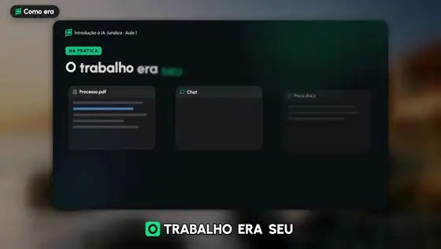
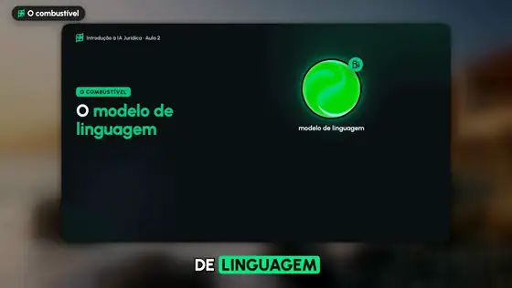
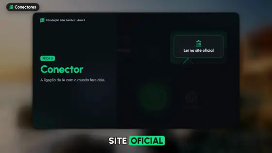
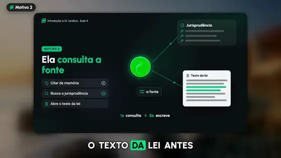
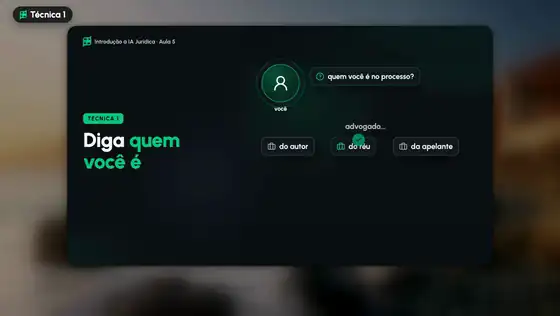
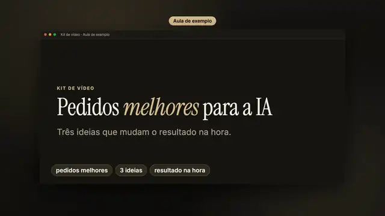
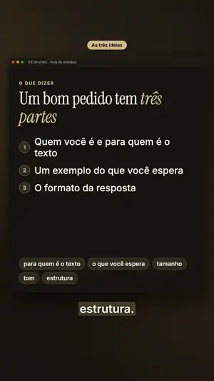
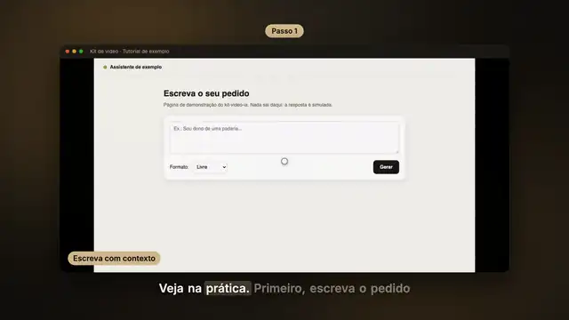

<div align="center">


<br/>

<a href="#-instalar"></a>
<a href="https://help.chatadv.com.br/hc/central-de-ajuda/articles/ia-juridica-intro-1"></a>
<a href="https://github.com/dantaspaulo"></a>


<br/><br/>

**As aulas da Central de Ajuda do ChatADV saem de um arquivo de texto.**<br/>
A IA narra, a tela anima no segundo em que a voz diz cada palavra, e uma conferência automática<br/>
recusa fala trocada, tela parada e som fora do padrão. Este kit abre o método: três skills para o<br/>
Claude e o estúdio que renderiza.

</div>

<br/>

<div align="center">

## 🎬 Aulas feitas com o método

<a href="https://help.chatadv.com.br/hc/central-de-ajuda/articles/ia-juridica-intro-1"></a>
<a href="https://help.chatadv.com.br/hc/central-de-ajuda/articles/ia-juridica-intro-2"></a>
<a href="https://help.chatadv.com.br/hc/central-de-ajuda/articles/ia-juridica-intro-3"></a>
<a href="https://help.chatadv.com.br/hc/central-de-ajuda/articles/ia-juridica-intro-4"></a>
<a href="https://help.chatadv.com.br/hc/central-de-ajuda/articles/ia-juridica-intro-5"></a>

<sub>Série <b>Introdução à IA Jurídica</b>, cinco aulas de 1,5 a 2 minutos, no ar na Central de Ajuda do ChatADV. Clique para assistir.<br/>
Estas usam cenas ilustradas feitas sob medida para cada aula. O estúdio do kit traz telas animadas prontas, com o mesmo método.</sub>

</div>

<br/>

<div align="center">

## 🧪 O que o kit gera, saindo da caixa

<a href="https://github.com/dantaspaulo/kit-video-ia/releases/latest/download/exemplo-h.mp4"></a>
<a href="https://github.com/dantaspaulo/kit-video-ia/releases/latest/download/exemplo-v.mp4"></a>
<br/>
<a href="https://github.com/dantaspaulo/kit-video-ia/releases/latest/download/tutorial-exemplo-h.mp4"></a>

<sub>A aula de exemplo (<code>aulas/exemplo.json</code>, 52 s, deitada e em pé) e o tutorial de exemplo (<code>aulas/tutorial-exemplo.json</code>),<br/>
do jeito que saem do kit, sem edição. Clique para baixar o vídeo com som.</sub>

</div>

<br/>

## 📥 Instalar

```bash
npx github:dantaspaulo/kit-video-ia
```

Um comando deixa tudo pronto, em cinco passos, e diz o que fez em cada um:

| | O que o instalador faz |
|---|---|
| **1. Skills** | copia as três skills para o Claude (para você, ou só para o projeto atual) |
| **2. Estúdio** | cria a pasta `estudio-video/` com o projeto pronto para renderizar |
| **3. Ferramentas** | instala as dependências do estúdio (**Remotion**, React, Playwright), baixa o navegador que o Remotion usa para renderizar e o do Playwright para gravar tela, e confere **ffmpeg** e **Python 3**; se faltar, instala pelo gerenciador do sistema (Homebrew, apt, dnf ou winget), com a sua confirmação |
| **4. Chaves e voz** | pede as chaves do **ElevenLabs** (a voz) e da **OpenAI** (a conferência da fala) sem mostrar na tela, guarda num `.env` só seu, põe a **voz Raquel** na sua conta e gera um áudio de teste |
| **5. Teste** | valida a aula de exemplo e confere que o Remotion monta o projeto |

Sem perguntas: `--tudo` (usa as chaves que estiverem no ambiente). Outras opções: `--projeto`,
`--skills aula-animada,tutorial-de-tela`, `--estudio ./minha-pasta`, `--sem-ferramentas`,
`--desinstalar`. Nada é apagado: skill que já existe vira cópia de segurança.

Depois, a primeira aula:

```bash
cd estudio-video && python3 scripts/kit.py fazer exemplo --formatos h,v
```

Ou abra o Claude e peça:

> faz uma aula narrada animada de 2 minutos sobre como escrever um bom e-mail de cobrança

> grava um tutorial de como cadastrar um cliente no meu sistema, sem mostrar dado real

**A voz:** vem configurada a **Raquel**, a mesma das aulas do ChatADV, uma voz pública em português
do Brasil da biblioteca do ElevenLabs (modelo `eleven_v4`, um pouco acelerada). Para trocar, é só
mudar o `voice_id` no `kit.config.json` e rodar `python3 scripts/kit.py voz`.

**App de gravação?** Não precisa. A janela, a sombra, o fundo desfocado como papel de parede, o
cursor e o zoom são desenhados pelo próprio estúdio. Vêm três fundos prontos (`champagne`, `oceano`
e `esmeralda`), ou use uma foto sua.

**Precisa ter antes:** Node 18+ (o resto o instalador resolve). Funciona no macOS, Linux e Windows.
No macOS, o ffmpeg vem pelo [Homebrew](https://brew.sh); sem ele, o instalador avisa o comando.

<br/>

## 🧭 Como funciona

Tudo sai de um arquivo, `aulas/<id>.json`: a fala de cada parte e a tela que vai com ela.

```bash
python3 scripts/kit.py fazer <id> --formatos h,v
```

| Etapa | O que faz | O que recusa |
|---|---|---|
| `validar` | confere o arquivo, de graça | travessão, palavra proibida, lista longa, zoom sem foco válido |
| `narrar` | gera a voz de cada parte com o tempo de cada palavra | · |
| `conferir` | transcreve a voz e compara com o roteiro; narra de novo o que errou, até 2 vezes | fala que não bate com o texto |
| `montar` | calcula quando cada elemento entra e gera o projeto do Remotion | palavra de `quando` que a fala não tem; **mais de 2,5 s sem nada novo**; aula acima de 4 min |
| `renderizar` | renderiza deitado (1920×1080) e/ou em pé (1080×1920) | · |
| `finalizar` | som em -14 LUFS, legendas `.vtt` e `.srt`, folha de quadros | **tela parada** medida no vídeo pronto |

`finalizar --pagina` também gera as versões leves (H.264, AV1 e pôster) para pôr numa página.

<br/>

## 🧩 As três skills

| Skill | Para quê |
|---|---|
| **aula-animada** | aula de conceito: o Claude pergunta o que falta, escreve o roteiro em partes (uma ideia por tela), monta o arquivo e roda o estúdio |
| **tutorial-de-tela** | grava o sistema com o Playwright (cursor visível, dado borrado, texto proibido descarta a gravação) e narra por cima, com zoom e holofote |
| **video-na-pagina** | publica o vídeo leve numa página ou central de ajuda: as versões, o pôster, a legenda e o HTML certo |

### Telas prontas

`capa`, `lista`, `colunas`, `fluxo`, `frase`, `numero` (conta até o valor), `imagem` e `video`. Cada
elemento entra na palavra dita (`"quando": "palavra"`), fichas (`chips`) põem novidade na tela, e o
zoom (`"foco": [x0, y0, x1, y1]`) enquadra o que importa e escurece o resto, sem cortar nada pela metade.

```json
{ "fala": "Primeiro, diga quem você é. Depois, mostre um exemplo.",
  "rotulo": "As ideias",
  "tela": { "tipo": "lista", "titulo": "Um bom pedido tem *três partes*",
            "itens": [{ "texto": "Quem você é", "quando": "quem" },
                      { "texto": "Um exemplo", "quando": "exemplo" }] } }
```

<br/>

## 📏 O método, em cinco regras

1. **Uma ideia por tela.** De 20 a 40 palavras por parte; a tela resume, não repete a fala.
2. **Nada parado mais de 2,5 s.** Duas travas medem: uma no plano, outra no vídeo pronto.
3. **A voz é conferida.** Errou, reescreve a frase. Não se afrouxa a trava.
4. **Zoom não corta.** O foco entra inteiro na luz; o resto fica no escuro.
5. **Dado real não aparece.** Conta de teste, dado fictício, e a gravação se descarta sozinha se escapar.

<br/>

## 💰 Custos e licenças

- **Voz:** ElevenLabs ou OpenAI, pagos por uso. Uma aula de 2 minutos é o TTS de uns 2 mil caracteres; a conferência custa centavos.
- **Remotion** (o renderizador): grátis para pessoas e empresas de até 3 pessoas; acima disso, [licença de empresa](https://www.remotion.dev/license).
- **Fontes:** Inter e Instrument Serif (licença OFL). **Playwright:** Apache 2.0.
- **O kit:** MIT. Use, adapte e compartilhe.

<br/>

<div align="center">

## 👋 Quem fez

<a href="https://github.com/dantaspaulo">
<picture>
  <source media="(max-width: 700px)" srcset="https://raw.githubusercontent.com/dantaspaulo/dantaspaulo/main/assets/papeis-celular.svg" />
  
</picture>
</a>

**Paulo Sérgio Dantas** constrói negócios com IA.<br/>
<sub>As aulas do ChatADV são feitas assim, com agentes de IA trabalhando comigo. Também abri a <a href="https://github.com/dantaspaulo/skill-perfil-github">skill perfil-github</a> e o <a href="https://github.com/dantaspaulo/playbook-saida-do-google-cloud">playbook de saída do Google Cloud</a>.</sub>

<br/>

<a href="https://github.com/dantaspaulo"></a>
<a href="https://paulosdantas.adv.br"></a>
<a href="https://www.linkedin.com/in/paulosdantas/"></a>
<a href="mailto:contato@paulosdantas.adv.br"></a>

<br/><br/>

<sub>Fez uma aula com o kit? Me manda o link.</sub>


[](https://aiagentslisting.com/mcp/kit-video-ia)

</div>
