<div align="center">


<br/>

<a href="#-instalar"></a>
<a href="#-tipos-de-v%C3%ADdeo"></a>
<a href="CHANGELOG.md"></a>


<br/><br/>

**Claquete.ai** (antes `kit-video-ia`) é o método com que são feitas as aulas, os tutoriais e os vídeos de redes do ChatADV.<br/>
Você escolhe o tipo de vídeo; o Claude escreve o roteiro e o plano de edição, grava a tela, narra, edita e revisa.<br/>
Você decide em dois pontos, e travas recusam roteiro sem ok, fala sem revisão e tela parada.

</div>

<br/>

## 🎬 Tipos de vídeo

Você escolhe o tipo quando começa um projeto novo. O Claude pergunta a duração (as aulas têm de 2 a 5 minutos, à sua
escolha), o público e o formato: deitado, em pé ou os dois.

| | Tipo | Para quê | Duração | Versão |
|---|---|---|---|---|
| | **Ensinar** | | | |
| 🖥️ | Demonstração de ferramenta | passo a passo de uma tarefa, com a IA operando o computador | 1 a 4 min | ✅ |
| 🧭 | Trilha de uma ferramenta | um curso: uma aula por recurso, na ordem em que se aprende a usar | aulas de 2 a 5 min | ✅ |
| 📂 | Caso completo | um caso do começo ao fim, em série, com a ferramenta trabalhando de verdade | aulas de 2 a 5 min | ✅ |
| 🎓 | Aula animada | aula didática e dinâmica, sem mostrar ferramenta | 2 a 5 min | ✅ |
| 💡 | Dica rápida | um recurso só, direto ao ponto | 30 a 90 s | ✅ |
| 📲 | Instrução no celular | passo a passo no celular, com as telas do sistema desenhadas | até 1 min | 🔜 2.3 |
| | **Redes e vendas** | | | |
| 🧑‍💼 | Avatar apresentador | pessoa gerada por IA apresentando o seu produto ou serviço | 15 a 40 s | 🔜 2.2 |
| 📣 | Anúncio demonstrativo | em pé, sem pessoa: gancho, a ferramenta trabalhando e o diferencial | 20 a 35 s | 🔜 2.2 |
| ✂️ | Corte viral | uma gravação longa vira vários Reels, com legenda palavra a palavra | 15 a 45 s | 🔜 2.2 |
| 🖼️ | Carrossel e imagem | peças de feed 4:5 tiradas do mesmo material | · | 🔜 2.2 |
| | **Marca** | | | |
| ✨ | Vinheta de marca | logo animado, abertura e encerramento, tipografia cinética e fundos animados | 3 a 10 s | 🔜 2.2 |
| 🌐 | Vídeo para página | versão leve para site ou central de ajuda, com pôster e legenda | · | ✅ |

<sub>Os exemplos abaixo foram feitos com este método no <b>ChatADV</b>, uma IA para advogados. Clique na imagem para ver o vídeo com som.</sub>

<br/>

### 🎓 Ensinar

<div align="center">
<a href="https://github.com/dantaspaulo/claquete/releases/download/v1.2.0/claquete-demo-tutorial.mp4">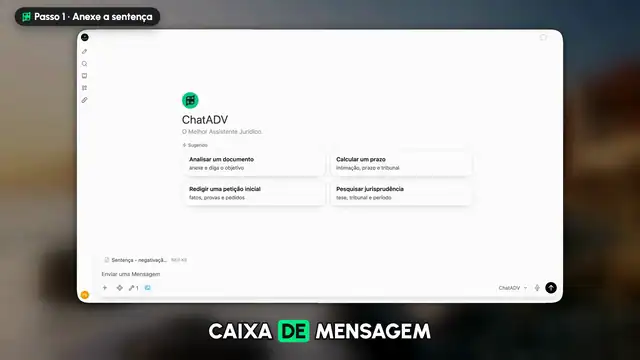</a>
<a href="https://github.com/dantaspaulo/claquete/releases/download/v1.2.0/claquete-demo-tutorial-em-pe.mp4">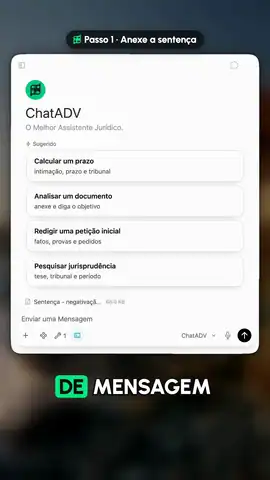</a>
<br/>
<sub><b>Demonstração de ferramenta</b>: o tutorial da apelação, deitado e em pé, saídos da mesma gravação.</sub>
<br/><br/>
<a href="https://github.com/dantaspaulo/claquete/releases/download/v1.2.0/claquete-demo-caso.mp4">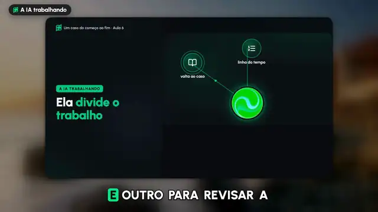</a>
<a href="https://github.com/dantaspaulo/claquete/releases/download/v2.0.0/claquete-celular-instalar.mp4">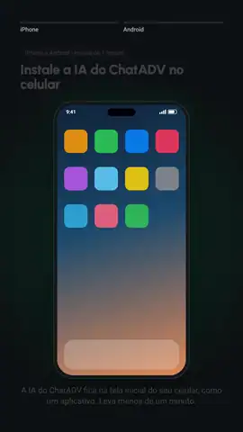</a>
<br/>
<sub><b>Caso completo</b>: aula 6 de <a href="https://help.chatadv.com.br/hc/central-de-ajuda/articles/caso-plano-de-saude-1">Um caso do começo ao fim</a>, a IA trabalhando de verdade, com cortes, zoom e cenas animadas entre os passos.
<b>Instrução no celular</b> (tipo da versão 2.3): instalar o app na tela inicial, com as telas do sistema desenhadas.</sub>
<br/><br/>
<a href="https://github.com/dantaspaulo/claquete/releases/download/v1.2.0/claquete-aula-animada.mp4">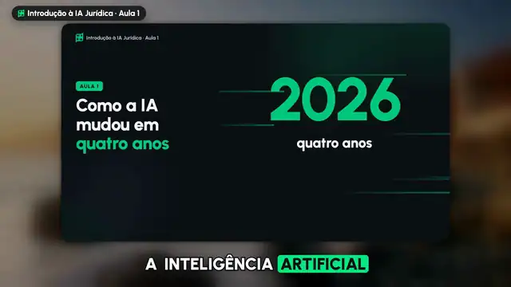</a>
<a href="https://github.com/dantaspaulo/claquete/releases/download/v1.2.0/claquete-aula-animada-2.mp4">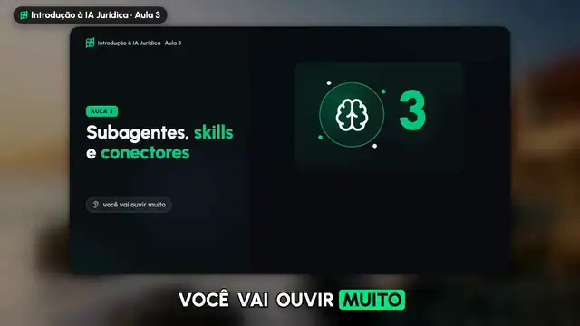</a>
<br/>
<sub><b>Aula animada</b>: aulas 1 e 3 da série <a href="https://help.chatadv.com.br/hc/central-de-ajuda/articles/ia-juridica-intro-1">Introdução à IA Jurídica</a>. Cada elemento entra no segundo em que a voz diz a palavra, e a câmera aproxima sem cortar texto.</sub>
</div>

### 🎞️ Telas animadas (novo na 2.1)

Cada tela de uma aula pode ser uma **cena em React**: texto que entra palavra a palavra, esfera de energia, aurora e
partículas no fundo, conversa sendo digitada, documento que se escreve, número que conta, câmera que aproxima sem cortar
nada. O Claude escreve a cena depois do seu ok ao roteiro, e o estúdio a **fotografa quadro a quadro com o relógio da
página controlado**, no segundo exato de cada palavra da voz, deitada e em pé. É o mesmo motor das aulas do ChatADV.

- **Componentes do React Bits, na sua máquina.** O instalador baixa do [reactbits.dev](https://reactbits.dev) 12
  componentes grátis (SplitText, BlurText, ShinyText, GradientText, RotatingText, TextType, CountUp, AnimatedList, Orb,
  Aurora, Beams e Particles). Com uma licença do **React Bits Pro**, baixa também os 6 que as aulas do ChatADV usam
  (StaggeredText, AgenticBall, SpeedingText, AnimatedList, MagicTransform e Globe).
- **Nada deles vem neste repositório.** A licença do React Bits (MIT + Commons Clause) não deixa redistribuir os
  componentes: cada um sai do registro oficial direto para a sua máquina, como faria o `npx shadcn add`. O teste do
  estúdio recusa componente do React Bits versionado aqui, e o pre-commit também (num clone novo, ligue com
  `git config core.hooksPath .githooks`).
- **Sem eles, funciona igual:** cada peça tem uma versão própria, feita só com motion.
- **Travas:** peça cortada pela metade na borda da câmera, zoom sem foco, cena com erro e tela parada por mais de 2,5 s
  são recusados na captura. `kit.py cenas <id> --previa` mostra cinco fotos de cada cena antes da captura inteira.

```json
{ "fala": "Primeiro, o contexto: diga quem você é e para quem é o texto.",
  "tela": { "tipo": "animada", "cena": "Cena2",
            "descricao": "Uma conversa: o pedido é digitado, a IA pensa e responde escrevendo." } }
```

A aula `animada-exemplo` do estúdio tem três cenas prontas para ver como se escreve.

> grava um tutorial de como cadastrar um cliente no meu sistema, deitado e em pé, sem mostrar dado real

> faz uma aula animada de 3 minutos sobre como escrever um bom e-mail de cobrança

<br/>

### 📱 Redes e vendas

<div align="center">
<a href="https://github.com/dantaspaulo/claquete/releases/download/v1.2.0/claquete-redes-avatar.mp4">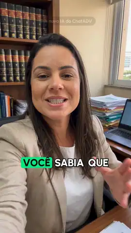</a>
<a href="https://github.com/dantaspaulo/claquete/releases/download/v1.2.0/claquete-redes-anuncio.mp4">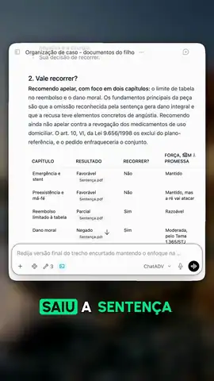</a>
<a href="https://github.com/dantaspaulo/claquete/releases/download/v2.0.0/claquete-redes-viral.mp4">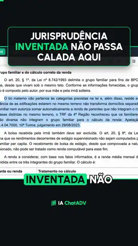</a>
<a href="https://github.com/dantaspaulo/claquete/releases/download/v1.2.0/claquete-editar-corte.mp4">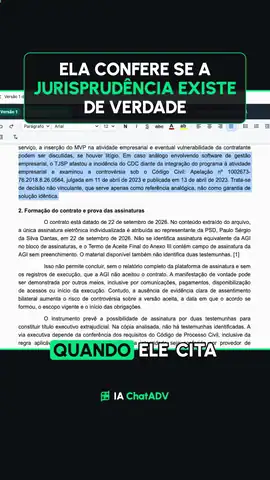</a>
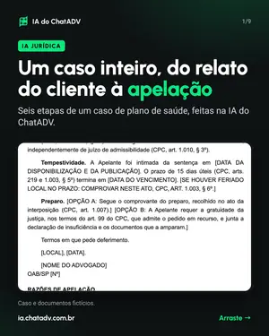
<br/>
<sub><b>Avatar apresentador</b>, <b>anúncio demonstrativo</b>, dois <b>cortes virais</b> (um narrado, outro tirado de uma gravação do Screen Studio) e um <b>carrossel</b>. Feitos com o método no ChatADV; estes tipos entram no kit na versão 2.2.</sub>
</div>

Chegam na versão 2.2. O avatar é trocável: **Higgsfield** como principal (a pessoa e a voz saem juntas do gerador) e
**HeyGen** como alternativa (o avatar fala sobre a voz da ElevenLabs, igual em todo vídeo). O avatar é apresentador,
nunca depoimento de cliente. O gancho fala do ganho de quem assiste, nos 2 primeiros segundos.

<br/>

### ✨ Marca

As [skills de motion design da iart.ai](https://github.com/iart-ai/motion-design-skills) (MIT) já são instaladas junto
e entram nos outros tipos: direção de arte, ritmo e composição nas aulas animadas, a paleta da sua marca, e corte no
tempo da música nos vídeos curtos. A vinheta de marca (logo animado, abertura e encerramento) vira um tipo próprio,
com modelo pronto no estúdio, na versão 2.2.

<br/>

## 🤖 Como o Claude trabalha

Editar não é um tipo de vídeo: é o jeito de trabalhar. O Claude orquestra sozinho as skills, as ferramentas do seu
computador, a voz e a revisão, e só para nos dois pontos em que a decisão é sua.

1. **Entende o pedido** e pergunta o que falta: tipo, duração, público, formato.
2. **Roteiro e plano de edição, para você aprovar.** A fala de cada parte e o que aparece na tela. Na demonstração,
   também o caminho na ferramenta, os cortes, as acelerações e os zooms. Nada é gravado nem narrado antes do seu ok.
3. **Executa:** opera o computador, grava, narra com a ElevenLabs, monta e edita.
4. **Revisa com subagentes:** fala, pronúncia e sotaque de cada parte, roteiro, texto na tela, ritmo (nada parado
   mais de 2,5 s), zoom e dado sensível.
5. **Corrige** o que reprovou e confere de novo, sem você pedir.
6. **Entrega para a sua aprovação.** Aprovado, o vídeo vai para a pasta que você escolher e a montagem é apagada.

<sub>Os dois portões são travas do estúdio, não combinados: o <code>narrar</code> recusa roteiro sem ok (ou mudado depois do
ok) e o <code>montar</code> recusa fala sem revisão. Editar gravações suas (Screen Studio, Recordly, qualquer vídeo) chega na 2.3.</sub>

<br/>

## 📥 Instalar

```bash
npx github:dantaspaulo/claquete
```

Já usa a versão 1? `npx github:dantaspaulo/claquete --atualizar` atualiza skills e estúdio e mantém os seus roteiros,
gravações, marca, chaves e configuração.

| | O que o instalador faz |
|---|---|
| **1. Skills** | copia as skills da Claquete e as de motion design da iart.ai (para você, ou só para o projeto atual) |
| **2. Estúdio** | cria a pasta `estudio-video/` com o projeto que monta os vídeos (ou atualiza a que já existe) |
| **3. Ferramentas** | instala Remotion, React e Playwright, baixa os navegadores, instala ffmpeg e Python 3 se faltarem, monta o app das telas animadas e **baixa do reactbits.dev os 12 componentes grátis** para a sua máquina e, se você quiser, a transcrição local e gratuita da fala (faster-whisper, num ambiente só do estúdio) |
| **4. Voz** | pede a chave da ElevenLabs sem mostrar na tela, guarda num `.env` só seu, põe a voz Raquel na sua conta e gera um áudio de teste. Tem licença do **React Bits Pro**? Ela é pedida aqui (opcional) e baixa os componentes Pro |
| **5. Sua marca** | um questionário: nome, público, site, Instagram, TikTok, cores, fontes, logo, estilo de movimento, tom, palavras proibidas, glossário da sua área, voz e a chamada do fim. Aceita também uma **pasta, um HTML, um `.md` ou um link** com o padrão da marca, que o Claude lê depois |
| **6. Teste** | valida o vídeo de exemplo, confere que o Remotion monta o projeto e que as telas animadas compilam |

**Uma chave só:** a da ElevenLabs (a licença do React Bits Pro é opcional). Nenhuma outra API: quem revisa a fala é a
própria sessão do Claude, com subagentes.

Sem perguntas: `--tudo`. Outras opções: `--atualizar`, `--projeto`, `--global`, `--skills claquete,aula-animada`,
`--estudio ./minha-pasta`, `--sem-ferramentas`, `--sem-motion`, `--sem-marca`, `--sem-cenas`, `--sem-reactbits`,
`--transcricao-local`, `--desinstalar`,
`--versao`. Instalar não apaga nada: skill que já existe vira cópia de segurança. O `--desinstalar` remove as skills e
deixa o estúdio.

**Precisa ter antes:** Node 18+ (o resto o instalador resolve). macOS, Linux ou Windows; no macOS, o ffmpeg vem pelo
[Homebrew](https://brew.sh).

<br/>

## 🧑‍💻 No dia a dia

Abra o Claude na pasta do estúdio e diga **"quero fazer um vídeo"**. Ele pergunta o tipo, a duração (nas aulas, de 2 a 5
minutos, à sua escolha), o público e o formato, lê a sua marca e conduz o resto.

- **Você decide em dois pontos:** o roteiro com o plano de edição, antes de gravar e narrar; e o vídeo pronto, antes de
  publicar. Entre um e outro, o Claude trabalha sozinho e corrige o que a revisão reprovar.
- **A IA opera o computador.** Na demonstração ela abre um navegador próprio, clica, digita e grava. Deixe a máquina
  livre durante a gravação: não mexa no mouse nessa janela e feche o que for pesado.
- **Memória e disco.** Gravar e renderizar usam bastante memória, e a montagem de cada vídeo ocupa centenas de MB até a
  entrega. Deixe uns 10 GB livres: o `renderizar` recusa sozinho com menos de 5 GB, e o `validar` e o `plano` avisam.
- **Só o vídeo final fica.** Aprovado, `entregar` copia o vídeo e as legendas para a sua pasta e apaga a montagem.
- **Material da marca depois:** diga "configura minha marca" e o Claude lê a pasta, o HTML ou o `.md` que você deu,
  completa a marca e mostra uma amostra no seu visual.

<br/>

## 🧭 Como funciona

Tudo sai de um arquivo, `aulas/<id>.json`: o tipo, a duração escolhida, a fala de cada parte e a tela que vai com ela.

| Comando | O que faz | O que recusa |
|---|---|---|
| `novo <id> --tipo aula --minutos 3` | cria o arquivo com o tipo e a duração | aula, caso ou trilha sem a duração de 2 a 5 min |
| `validar` | confere o arquivo, de graça | travessão, palavra proibida, lista longa, zoom sem foco válido, fonte fora do Google Fonts; avisa duração fora do alvo, gravação que ainda não existe e disco com menos de 5 GB livres |
| `plano` | escreve o roteiro e o plano de edição num documento só, com o caminho na ferramenta (`caminho`) e o que será gravado depois do ok | · |
| `aprovar` | **portão 1**: registra o ok da pessoa (o `de` das gravações fica fora dele) | arquivo com erro |
| `narrar` | gera a voz de cada parte, com o tempo de cada palavra | roteiro sem ok, ou mudado depois do ok |
| `conferir` | **portão 2**: relatório da fala para a revisão (com transcrição local, se instalada); `--aprovado` libera | narração que mudou depois do relatório; parte que a transcrição local reprovou |
| `cenas` | fotografa as telas animadas quadro a quadro, no tempo da voz, deitadas e em pé (`--previa`: cinco fotos de cada uma) | fala sem revisão; cena que não existe ou com erro; peça cortada na borda da câmera; tela parada |
| `montar` | calcula quando cada elemento entra e gera o projeto do Remotion, sempre com os dois formatos | fala sem revisão; gravação ou imagem que não existe; tela animada não fotografada ou mudada depois; **mais de 2,5 s sem nada novo**; duração fora do tipo ou da escolha |
| `renderizar` | renderiza deitado (1920×1080) e/ou em pé (1080×1920), conforme `--formatos` (padrão `h`) | menos de 5 GB livres no disco |
| `finalizar` | som em -14 LUFS, legendas `.vtt` e `.srt`, folha de quadros | **tela parada** medida no vídeo pronto |
| `entregar <id> --destino <pasta>` | copia o vídeo final, confere a cópia e apaga a montagem | cópia que não bate de tamanho |

`fazer <id>` roda tudo na ordem e para nos portões (código 2). `--formatos h`, `v` ou `h,v` vale para `renderizar`,
`finalizar` e `fazer`. `finalizar --pagina` também gera as versões leves (H.264, AV1 com `+faststart` e pôster) para
pôr numa página, e roda de novo sobre um vídeo já finalizado; sem render nenhum, ele para com "não há render".

Para provar que as travas do seu estúdio estão de pé: `python3 scripts/teste.py` (grátis, a voz é um tom gerado na
hora). Ele tenta passar por cada portão sem o ok e falha se algum deixar.

<br/>

## 🧩 As skills

| Skill | Para quê |
|---|---|
| **claquete** | a porta de entrada: pergunta o tipo, a duração e o formato, lê a marca e conduz o fluxo com os dois portões |
| **claquete-marca** | lê o material da marca (pasta, HTML, `.md`, link), completa a marca e mostra uma amostra para aprovar |
| **aula-animada** | aula didática de 2 a 5 minutos, sem mostrar ferramenta, com cenas no tempo da fala |
| **tutorial-de-tela** | demonstração de ferramenta, dica, caso completo e trilha: roteiro de uso, plano de edição, gravação com o Playwright (cursor visível, dado borrado, texto proibido descarta a gravação) e narração com zoom e destaque |
| **video-na-pagina** | publica o vídeo leve numa página ou central de ajuda: as versões, o pôster, a legenda e o HTML certo |
| **motion design** (iart.ai) | `animation-principles`, `motion-art-direction`, `shot-composition`, `color-motion`, `motion-background`, `logo-animation`, `beat-sync-editing`, `remotion-video` e `after-effects`, instaladas junto (MIT) |

### Telas prontas

`capa`, `lista`, `colunas`, `fluxo`, `frase`, `numero` (conta até o valor), `imagem`, `video` e, desde a 2.1,
`animada` (a cena em React, com os componentes do React Bits que estiverem na sua máquina). Cada
elemento entra na palavra dita (`"quando": "palavra"`), fichas (`chips`) põem novidade na tela, e o
zoom (`"foco": [x0, y0, x1, y1]`) enquadra o que importa e escurece o resto, sem cortar nada pela metade.

```json
{ "fala": "Primeiro, diga quem você é. Depois, mostre um exemplo.",
  "rotulo": "As ideias",
  "tela": { "tipo": "lista", "titulo": "Um bom pedido tem *três partes*",
            "itens": [{ "texto": "Quem você é", "quando": "quem" },
                      { "texto": "Um exemplo", "quando": "exemplo" }] } }
```

<br/>

## 📏 O método, em cinco regras

1. **Uma ideia por tela.** De 20 a 40 palavras por parte; a tela resume, não repete a fala.
2. **Nada parado mais de 2,5 s.** Duas travas medem: uma no plano, outra no vídeo pronto.
3. **A voz é conferida.** Errou, reescreve a frase. Não se afrouxa a trava.
4. **Zoom não corta.** O foco entra inteiro na luz e o resto fica no escuro; confira cada zoom na folha de quadros.
5. **Dado real não aparece.** Conta de teste, dado fictício, e a gravação se descarta sozinha se aparecer um texto que você marcou como proibido.

<br/>

## 💰 Custos e licenças

- **Voz:** ElevenLabs, paga por uso. Uma aula de 2 minutos é o TTS de uns 2 mil caracteres.
- **Revisão da fala:** de graça. Quem revisa é a sessão do Claude; a transcrição, se instalada, roda na sua máquina.
- **Avatar (versão 2.2):** pago ao provedor que você escolher. Na Higgsfield (Wan 3.0, 720p), uma tomada de 25 s custou US$ 2,00 a 2,60.
- **Remotion** (o renderizador): grátis para pessoas e empresas de até 3 pessoas; acima disso, [licença de empresa](https://www.remotion.dev/license).
- **React Bits:** os componentes grátis são MIT + Commons Clause (use em qualquer projeto, inclusive comercial; só não
  revenda nem redistribua os componentes). O Pro segue a licença que você comprou. Nenhum dos dois vem neste repositório.
- **Fontes:** as da sua marca vêm do Google Fonts (quase todas OFL; confira a da sua); as do estúdio, Inter e Instrument
  Serif, são OFL. **Playwright:** Apache 2.0.
- **Claquete.ai:** MIT. Use, adapte e compartilhe. Versões e mudanças no [CHANGELOG](CHANGELOG.md).

<br/>

<div align="center">

## 👋 Quem fez

<a href="https://github.com/dantaspaulo">
<picture>
  <source media="(max-width: 700px)" srcset="https://raw.githubusercontent.com/dantaspaulo/dantaspaulo/main/assets/papeis-celular.svg" />
  
</picture>
</a>

**Paulo Sérgio Dantas** constrói negócios com IA.<br/>
<sub>As aulas do ChatADV são feitas assim, com agentes de IA trabalhando comigo. Também abri a <a href="https://github.com/dantaspaulo/skill-perfil-github">skill perfil-github</a> e o <a href="https://github.com/dantaspaulo/playbook-saida-do-google-cloud">playbook de saída do Google Cloud</a>.</sub>

<br/>

<a href="https://github.com/dantaspaulo"></a>
<a href="https://paulosdantas.adv.br"></a>
<a href="https://www.linkedin.com/in/paulosdantas/"></a>
<a href="mailto:contato@paulosdantas.adv.br"></a>

<br/><br/>

<sub>Fez um vídeo com a Claquete? Me manda o link.</sub>


[](https://aiagentslisting.com/mcp/kit-video-ia)

</div>
